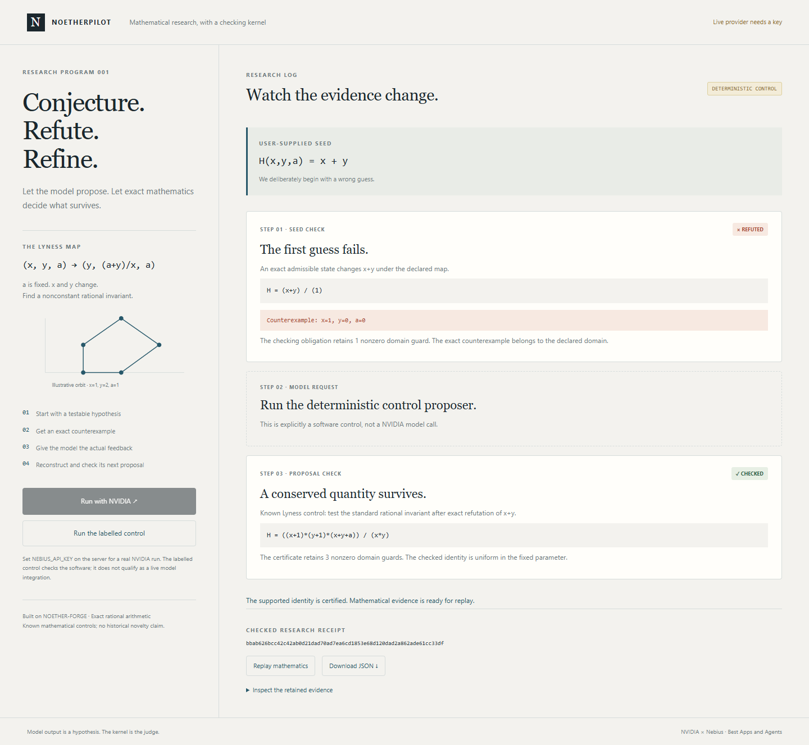

# NoetherPilot

**A model proposes an invariant. Exact mathematics rejects the wrong guess and checks the next one.**



NoetherPilot builds a bounded mathematical research loop around the existing Apache-2.0 NOETHER-FORGE kernel. The new Nebius Token Factory adapter selects an actual available NVIDIA model from the authenticated catalog and sends the exact counterexample back as feedback. Expressions are data; generated code is never run.

## Run locally

Python 3.12+, from this source checkout, no third-party runtime dependencies:

```sh
python -B -m noetherpilot serve
```

Open <http://127.0.0.1:4188>. The labelled deterministic control runs without a key and tests the complete mathematics/receipt workflow. It does not satisfy the hackathon's live sponsor requirement.

```sh
python -B -m noetherpilot run --provider control --out evidence/control-receipt.json
python -B -m noetherpilot replay --receipt evidence/control-receipt.json
python -B -m unittest discover -s tests -v
```

## Real NVIDIA run

Configure `NEBIUS_API_KEY` in the process that starts the application, using your secret manager or environment. Do not put the key in source, a browser field, a commit or chat. `.env.example` documents variable names; the application does not automatically read `.env` files.

```sh
python -B -m noetherpilot run --provider nebius --rounds 2 --out evidence/live-receipt.json
python -B -m noetherpilot replay --receipt evidence/live-receipt.json
```

The client calls `https://api.tokenfactory.nebius.com/v1/models` and chooses a model whose catalog identity begins with `nvidia/`, preferring a Nano model. `NEBIUS_MODEL` can select a specific model only if it exists in that catalog and belongs to the NVIDIA namespace. At most three rounds are permitted; the default is two, with 900 output tokens per request. Failed provider calls never silently become a deterministic control.

**Current validation: local control and HTTP/provider contract tests pass. No authenticated live NVIDIA call has been executed.** An injected HTTP fixture is labelled `PROVIDER_CONTRACT_FIXTURE` and contributes zero live calls. The included local video is labelled control execution. A real provider receipt is required before claiming the sponsor integration is demonstrated.

## What is being checked

The fixed problem is the symbolic Lyness recurrence `(x,y,a) → (y,(a+y)/x,a)`, with `a` fixed. The user seed `x+y` is refuted by an exact admissible counterexample. The next proposal receives that evidence. A supported nonconstant rational invariant is accepted only after independently reconstructing and checking its identity with retained nonzero guards.

The example control `(x+1)*(y+1)*(x+y+a)/(x*y)` is known mathematics. We claim neither historical novelty nor autonomous discovery from this control. The contribution is the closed feedback loop, provider adapter, observable research log and replayable evidence.

Receipt replay recomputes mathematical obligations and engine identity, without calling the model again or attesting a cloud provider. Failed proposals and provider errors remain in the log.

## Provenance and event scope

The kernel was copied under Apache-2.0 with [vendor/PROVENANCE.json](vendor/PROVENANCE.json) and original notices. The provider adapter, research loop, web interface, event log, receipt binding and tests were built on 8 October 2026. See [NEW_WORK.md](NEW_WORK.md).

Target: Nebius's global AI hackathon, **Best Apps and Agents**. This entry uses Token Factory text generation; it does not claim Token Factory Sandboxes, a Coding track integration, hardware access or a live provider result. The full source/test build is the local working-demo route; public video upload and live integration remain completion gates.

Codex assisted implementation, testing and documentation. [evidence/tests.txt](evidence/tests.txt) retains actual results. Application and copied kernel remain Apache-2.0.

## Reviewable demo and test build

The [English narrated local demo](media/demo-narrated.mp4) is under three minutes. Playback timing is visibly adjusted from the retained [original recording](media/demo-local.webm); the narration identifies local/control execution and any live integration still pending. A GitHub-hosted file does not replace the required public YouTube/Vimeo submission URL.

The complete Python source/test build is published through the repository release at `v0.1.0`. Extract it, open a terminal in the extracted folder, and follow the launch command above.

For a bounded paired comparison after live access is configured, run `python -B benchmark_feedback.py --provider nebius --repetitions 2`. It compares exact feedback with withheld feedback on the same catalog-selected model, alternates arm order, and retains each receipt. The executed control comparison passed both arms (one of one each), establishing no measured live-model improvement.
